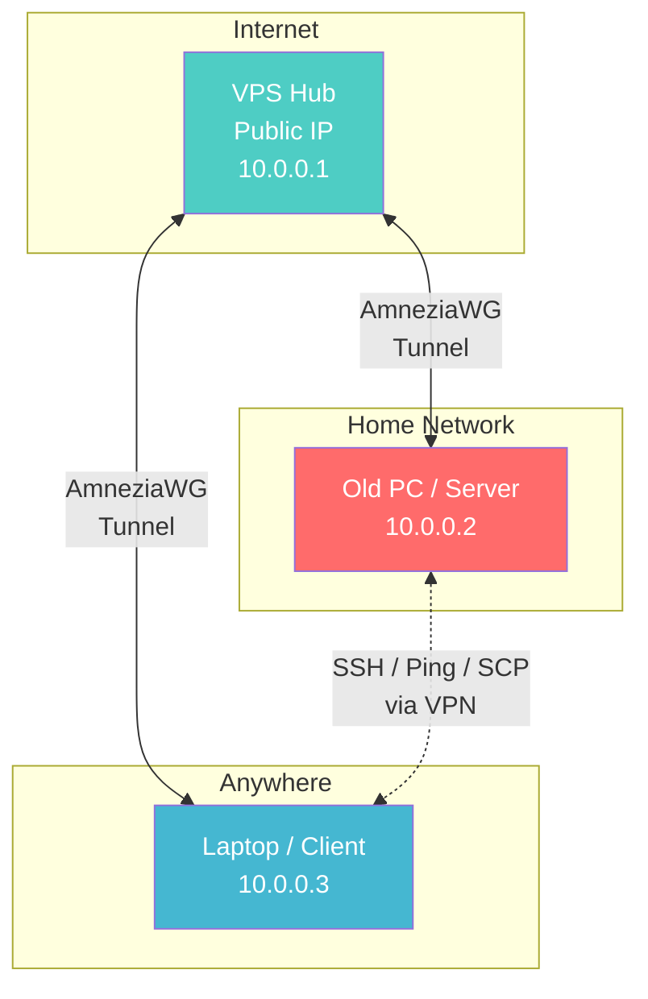
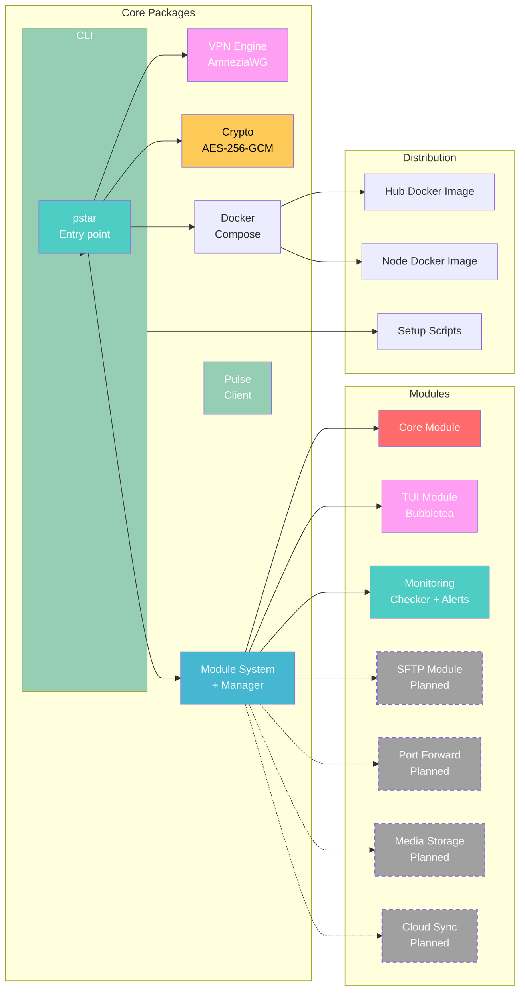
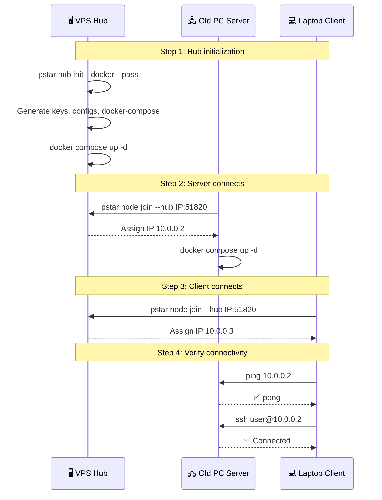
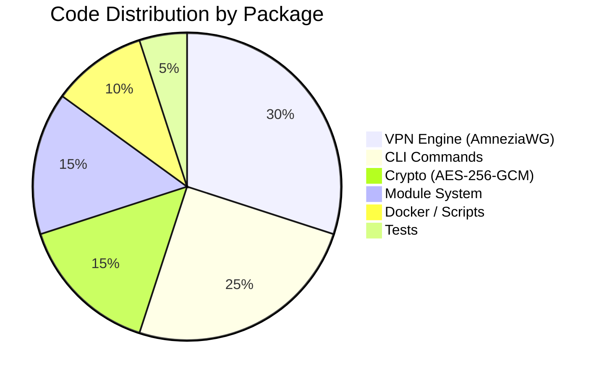

# ⭐ Pocket Star

<div align="center">


[](README.ru.md)


**Turn your old computer into a personal server without a public IP. Your home, reachable from anywhere.**

[📖 Documentation](#documentation) • [🚀 Quick Start](#quick-start) • [🏗️ Architecture](#architecture) • [🛠️ Technology Stack](#technology-stack) • [📦 Modules](#modules)

</div>

---

## 📋 Table of Contents

- [About the Project](#about-the-project)
- [Architecture](#architecture)
- [Technology Stack](#technology-stack)
- [Quick Start](#quick-start)
- [Commands](#commands)
- [Modules](#modules)
- [Master Password](#master-password)
- [Development](#development)
- [Documentation](#documentation)

---

## 🎯 About the Project

Pocket Star solves the problem when you have an old PC you want to use as a server (file storage, local AI inference, dev environment), but your ISP doesn't give you a public IP. Renting a VPS with the same specs as your old PC would cost a fortune.

Instead, you rent the **cheapest VPS** (~$3/mo) — it acts as a hub with a public IP. Your server and your laptop connect to it via AmneziaWG, forming a virtual local network. Just like that, your server is accessible from anywhere.

### Key Features

✨ **For users:**
- 🔌 Site-to-site VPN in minutes — connect your old PC and laptop into one network
- 🔒 AES-256-GCM encrypted configs with master password
- 🐳 Docker Compose support for hub and server nodes
- 🖥️ Native WireGuard GUI support — import the config and connect
- 🔧 Modular design — extend with plugins

---

## 🏗️ Architecture

### Network topology



### Project structure



### Connection sequence



---

## 🛠️ Technology Stack

### Core
- **Go 1.25+** — single binary, cross-platform compilation
- **AmneziaWG** — VPN with obfuscation, WireGuard-compatible
- **cobra** — CLI framework

### Security
- **Curve25519** — cryptographic key exchange
- **AES-256-GCM** — config encryption with master password

### Infrastructure
- **Docker & Docker Compose** — containerization for hub and server
- **Alpine Linux** — base image for Docker images

### VPN Protocols
- **AmneziaWG** — default VPN with DPI obfuscation
- **WireGuard** — fully compatible, import .conf into any WG client

---

## 🚀 Quick Start

### Prerequisites
- Docker and Docker Compose (for hub and server)
- A cheap VPS with a public IP (any provider)
- Linux / macOS on the client machine

### Installation

```bash
curl -sSL https://github.com/reneget/Pocket-Star/raw/main/scripts/quick-start.sh | bash
```

### 1. Initialize Hub on VPS

```bash
pstar hub init --docker --pass
# → Creates: hub.conf, docker-compose.yml, encrypted client configs
# → Set a master password (protects node configs)

docker compose -f pstar-data/docker-compose.yml up -d
```

### 2. Connect Server (Old PC)

```bash
pstar node join --hub <YOUR_VPS_IP>:51820 --docker --name server
# → Enter the master password you set on the hub

docker compose -f pstar-data/docker-compose.yml up -d
```

**No Docker?** Copy `pstar-data/clients/server.conf` from the hub and import it into WireGuard / AmneziaWG GUI.

### 3. Connect Client (Laptop)

```bash
pstar node join --hub <YOUR_VPS_IP>:51820 --name work-laptop
# Enter master password → connected.
```

**Or via GUI:** copy `work-laptop.conf` → import into WireGuard/Amnezia → Connect.

### 4. Verify

```bash
ping 10.0.0.2               # Ping the server
ssh user@10.0.0.2           # SSH into it
scp file user@10.0.0.2:~/  # Copy files directly
```

---

## ⌨️ Commands

| Command | Description |
|---------|-------------|
| `pstar hub init --docker --pass` | Initialize hub on VPS |
| `pstar hub status` | List connected peers |
| `pstar node join --hub X [--docker]` | Connect this machine as a node |
| `pstar node status` | VPN connection status |
| `pstar module list` | List available modules |
| `pstar module enable <name>` | Enable a module |
| `pstar module disable <name>` | Disable a module |
| `pstar decrypt <file>` | Decrypt a config with master password |
| `pstar doctor` | Run system diagnostics |
| `pstar version` | Print version |

---

## 📦 Modules

Everything is built as pluggable modules. You can write your own by implementing one interface:

```go
type Module interface {
    Name() string
    Priority() int
    Dependencies() []string
    Init(*Context) error
    Start() error
    Stop() error
    Status() Status
}
```

### ✅ Available

| Module | Description | Status |
|--------|-------------|--------|
| **core** | VPN + routing | Done |
| **tui** | Terminal UI (bubbletea, mouse, tabs, commands) | Done |
| **monitor** | System/Docker/peer health checks, alerts, ring buffer store | Done |
| **pulse** | Pulse REST API client for remote metrics | Done |

### 🔲 Planned

| Module | Description |
|--------|-------------|
| **sftp** | File sharing over SFTP |
| **port-fwd** | Forward ports through the hub |
| **dashboard** | Web UI |
| **media** | Media storage server (Jellyfin/Immich) |
| **cloud** | Cloud storage & file sync (Nextcloud) |

---

## 🔒 Master Password

Node configs are encrypted with **AES-256-GCM** using a master password. This protects private keys during transfer over SCP or any other channel.

```bash
# On hub: configs are saved as *.conf.enc
# On node: run `pstar decrypt server.conf.enc` and enter the password
# Or just: `pstar node join` — it prompts for the password automatically
```

---

## 🔧 Development

### Build

```bash
go build -o pstar ./cmd/pstar
```

### Test

```bash
go test ./...
```

### Cross-compile

```bash
GOOS=linux GOARCH=arm64 go build -o pstar-arm64 ./cmd/pstar
GOOS=linux GOARCH=amd64 go build -o pstar-linux ./cmd/pstar
GOOS=darwin GOARCH=amd64 go build -o pstar-macos ./cmd/pstar
```

### Project structure

```
pocket-star/
├── cmd/pstar/           # Entry point
├── pkg/
│   ├── cli/             # CLI commands (hub, node, module, doctor)
│   ├── config/          # AES-256-GCM encryption
│   ├── vpn/             # AmneziaWG key + config generation
│   ├── module/          # Module interface + registry
│   └── docker/          # docker-compose generation
├── modules/
│   └── core/            # Core module (VPN)
├── images/
│   ├── hub/Dockerfile
│   └── node/Dockerfile
└── scripts/
    ├── quick-start.sh   # curl-to-bash installer
    └── bootstrap.sh     # Fully automated setup
```

---

## 📊 Project Stats



---

## 📖 Documentation

- [README.ru.md](./README.ru.md) — Russian version of this document

---

## 🤝 Contributing

We welcome contributions! Please:

1. Fork the repository
2. Create a feature branch (`git checkout -b feature/AmazingFeature`)
3. Commit your changes (`git commit -m 'Add some AmazingFeature'`)
4. Push to the branch (`git push origin feature/AmazingFeature`)
5. Open a Pull Request

---

## 📝 License

This project is licensed under the MIT License — see the [LICENSE](LICENSE) file for details.

---

## 👥 Authors

- **[reneget](https://github.com/reneget)**

---

## ⭐ Star History

<div align="center">

[](https://star-history.com/#reneget/Pocket-Star&Date)

</div>

---

<div align="center">

**Made with ❤️ to turn old PCs into servers**

⭐ If this project helped you, give it a star!

</div>
