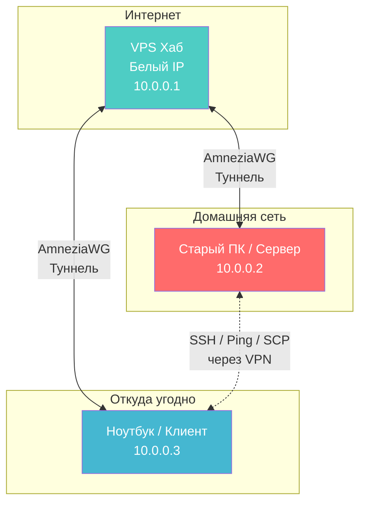
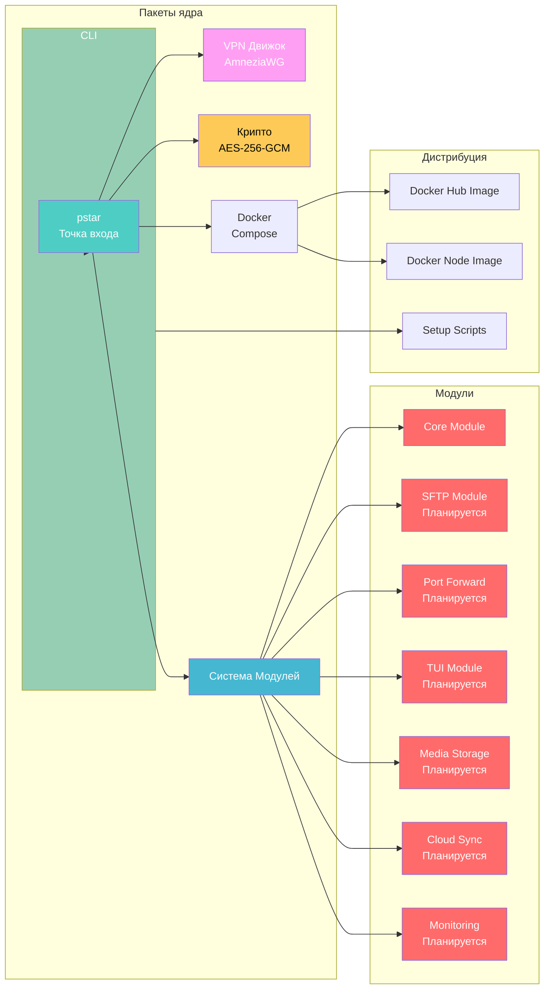
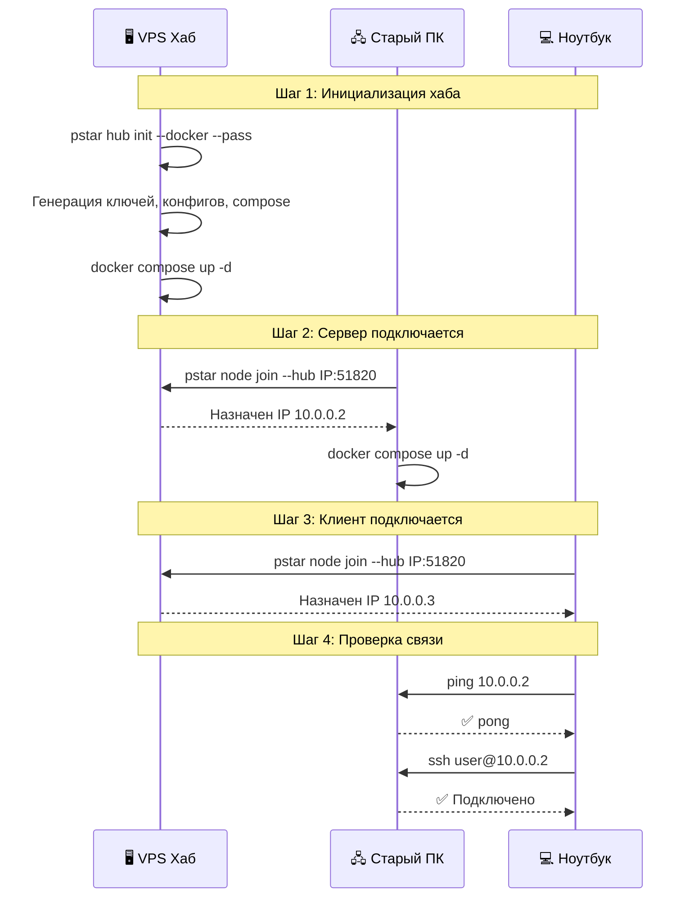
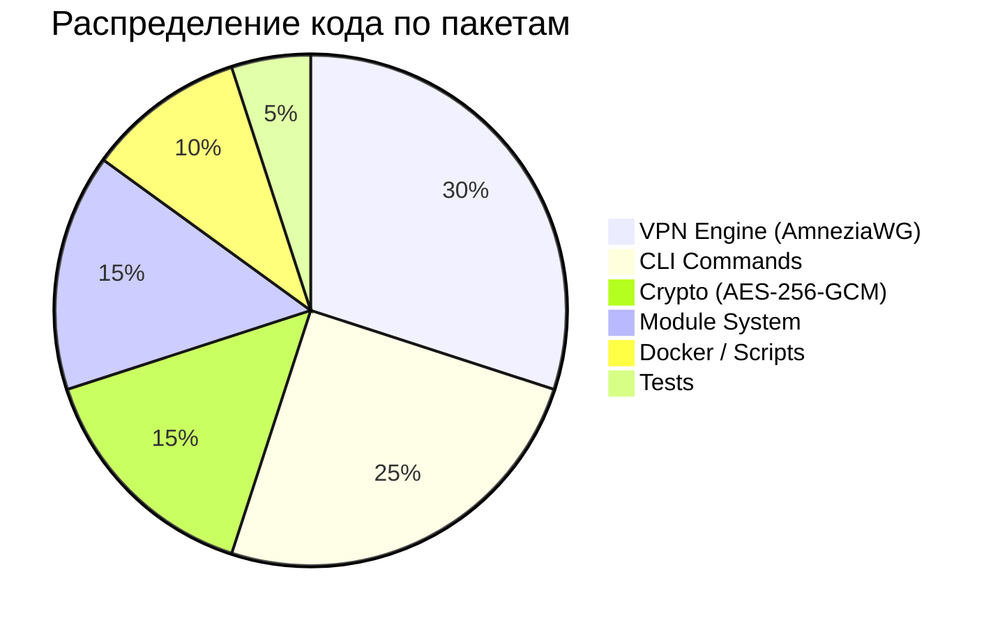

# ⭐ Pocket Star

<div align="center">


[](README.md)


**Преврати старый компьютер в личный сервер без белого IP. Твой дом, доступный откуда угодно.**

[📖 Документация](#документация) • [🚀 Быстрый старт](#быстрый-старт) • [🏗️ Архитектура](#архитектура) • [🛠️ Технологический стек](#технологический-стек) • [📦 Модули](#модули)

</div>

---

## 📋 Содержание

- [О проекте](#о-проекте)
- [Архитектура](#архитектура)
- [Технологический стек](#технологический-стек)
- [Быстрый старт](#быстрый-старт)
- [Команды](#команды)
- [Модули](#модули)
- [Мастер-пароль](#мастер-пароль)
- [Разработка](#разработка)
- [Документация](#документация)

---

## 🎯 О проекте

У тебя есть старый ПК, который хочется использовать как сервер (файлопомойка, локальные нейросети, дев-среда), но провайдер не даёт белый IP. Арендовать VPS с мощностями твоего старого железа — дорого.

Вместо этого ты снимаешь **самый дешёвый VPS** (~$3/мес) — он работает хабом с белым IP. Твой сервер и ноутбук подключаются к нему через AmneziaWG, образуя виртуальную локальную сеть. Всё, сервер доступен откуда угодно.

### Основные возможности

✨ **Для пользователей:**
- 🔌 Site-to-site VPN за минуты — старый ПК и ноутбук в одной сети
- 🔒 AES-256-GCM шифрование конфигов мастер-паролем
- 🐳 Docker Compose для хаба и сервера
- 🖥️ Поддержка нативных WG-клиентов — импорт .conf и коннект
- 🔧 Модульная архитектура — расширяй плагинами

---

## 🏗️ Архитектура

### Схема сети



### Структура проекта



### Последовательность подключения



---

## 🛠️ Технологический стек

### Ядро
- **Go 1.25+** — один бинарник, кроссплатформенная компиляция
- **AmneziaWG** — VPN с обфускацией, совместим с WireGuard
- **cobra** — CLI-фреймворк

### Безопасность
- **Curve25519** — криптографический обмен ключами
- **AES-256-GCM** — шифрование конфигов мастер-паролем

### Инфраструктура
- **Docker & Docker Compose** — контейнеризация хаба и сервера
- **Alpine Linux** — базовый образ для Docker

### VPN протоколы
- **AmneziaWG** — VPN по умолчанию с защитой от DPI
- **WireGuard** — полная совместимость, импорт .conf в любой клиент

---

## 🚀 Быстрый старт

### Предварительные требования
- Docker и Docker Compose (для хаба и сервера)
- Дешёвый VPS с белым IP (любой провайдер)
- Linux / macOS на клиенте

### Установка

```bash
curl -sSL https://github.com/reneget/Pocket-Star/raw/main/scripts/quick-start.sh | bash
```

### 1. Инициализация хаба на VPS

```bash
pstar hub init --docker --pass
# → Создаёт: hub.conf, docker-compose.yml, зашифрованные конфиги узлов
# → Придумай мастер-пароль (он защищает конфиги узлов)

docker compose -f pstar-data/docker-compose.yml up -d
```

### 2. Подключение сервера (старый ПК)

```bash
pstar node join --hub <IP_ТВОЕГО_VPS>:51820 --docker --name server
# → Введи мастер-пароль (тот же, что задал на хабе)

docker compose -f pstar-data/docker-compose.yml up -d
```

**Без Docker?** Скопируй `pstar-data/clients/server.conf` с хаба — импортируй в WireGuard / AmneziaWG GUI.

### 3. Подключение клиента (ноутбук)

```bash
pstar node join --hub <IP_ТВОЕГО_VPS>:51820 --name work-laptop
# Введи мастер-пароль → подключено.
```

**Или через GUI:** скопируй `work-laptop.conf` → импорт в WireGuard/Amnezia → Connect.

### 4. Проверка

```bash
ping 10.0.0.2               # Пингуем сервер
ssh user@10.0.0.2           # SSH
scp file user@10.0.0.2:~/  # Файлы туда-сюда
```

---

## ⌨️ Команды

| Команда | Описание |
|---------|----------|
| `pstar hub init --docker --pass` | Инициализация хаба на VPS |
| `pstar hub status` | Список подключённых узлов |
| `pstar node join --hub X [--docker]` | Подключить эту машину как узел |
| `pstar node status` | Статус VPN-соединения |
| `pstar module list` | Список модулей |
| `pstar module enable <name>` | Включить модуль |
| `pstar module disable <name>` | Отключить модуль |
| `pstar decrypt <файл>` | Расшифровать конфиг мастер-паролем |
| `pstar doctor` | Диагностика системы |
| `pstar version` | Версия |

---

## 📦 Модули

Всё строится как подключаемые модули. Ты можешь написать свой, реализовав один интерфейс:

```go
type Module interface {
    Name() string
    Priority() int
    Dependencies() []string
    Init(*Context) error
    Start() error
    Stop() error
    Status() Status
}
```

### Доступные

- **core** — VPN + маршрутизация (MVP) ✅
- **tui** — терминальный интерфейс (вдохновлён opencode) ✅

### Планируемые

- **sftp** — файлообменник через SFTP
- **port-fwd** — проброс портов через хаб
- **dashboard** — веб-интерфейс
- **media** — медиа-сервер (доступ с телефона/TV; на базе Jellyfin/Immich)
- **cloud** — облачное хранилище и синхронизация (как OneDrive; на базе Nextcloud)
- **monitoring** — мониторинг состояния системы (Pulse или Uptime Kuma)

---

## 🔒 Мастер-пароль

Конфиги узлов шифруются **AES-256-GCM** мастер-паролем. Это защищает приватные ключи при передаче через SCP или другие каналы.

```bash
# На хабе: конфиги сохраняются как *.conf.enc
# На узле: запусти `pstar decrypt server.conf.enc` и введи пароль
# Или просто: `pstar node join` — пароль запросится автоматически
```

---

## 🔧 Разработка

### Сборка

```bash
go build -o pstar ./cmd/pstar
```

### Тесты

```bash
go test ./...
```

### Кросс-компиляция

```bash
GOOS=linux GOARCH=arm64 go build -o pstar-arm64 ./cmd/pstar
GOOS=linux GOARCH=amd64 go build -o pstar-linux ./cmd/pstar
GOOS=darwin GOARCH=amd64 go build -o pstar-macos ./cmd/pstar
```

### Структура проекта

```
pocket-star/
├── cmd/pstar/           # Точка входа
├── pkg/
│   ├── cli/             # CLI команды (hub, node, module, doctor)
│   ├── config/          # AES-256-GCM шифрование
│   ├── vpn/             # Генерация ключей и конфигов AmneziaWG
│   ├── module/          # Интерфейс модулей + реестр
│   └── docker/          # Генерация docker-compose
├── modules/
│   └── core/            # core-модуль (VPN)
├── images/
│   ├── hub/Dockerfile
│   └── node/Dockerfile
└── scripts/
    ├── quick-start.sh   # curl → bash установщик
    └── bootstrap.sh     # Полная автоматическая настройка
```

---

## 📊 Статистика проекта



---

## 📖 Документация

- [README.en.md](./README.md) — английская версия

---

## 🤝 Вклад в проект

Мы приветствуем вклад в развитие проекта! Пожалуйста:

1. Создайте форк проекта
2. Создайте ветку для новой функции (`git checkout -b feature/AmazingFeature`)
3. Зафиксируйте изменения (`git commit -m 'Add some AmazingFeature'`)
4. Отправьте в ветку (`git push origin feature/AmazingFeature`)
5. Откройте Pull Request

---

## 📝 Лицензия

Этот проект лицензирован под MIT License — см. файл [LICENSE](LICENSE) для деталей.

---

## 👥 Авторы

- **[reneget](https://github.com/reneget)**

---

## ⭐ История звёзд

<div align="center">

[](https://star-history.com/#reneget/Pocket-Star&Date)

</div>

---

<div align="center">

**Сделано с ❤️ чтобы дать вторую жизнь старым ПК**

⭐ Если проект был полезен, поставьте звезду!

</div>
